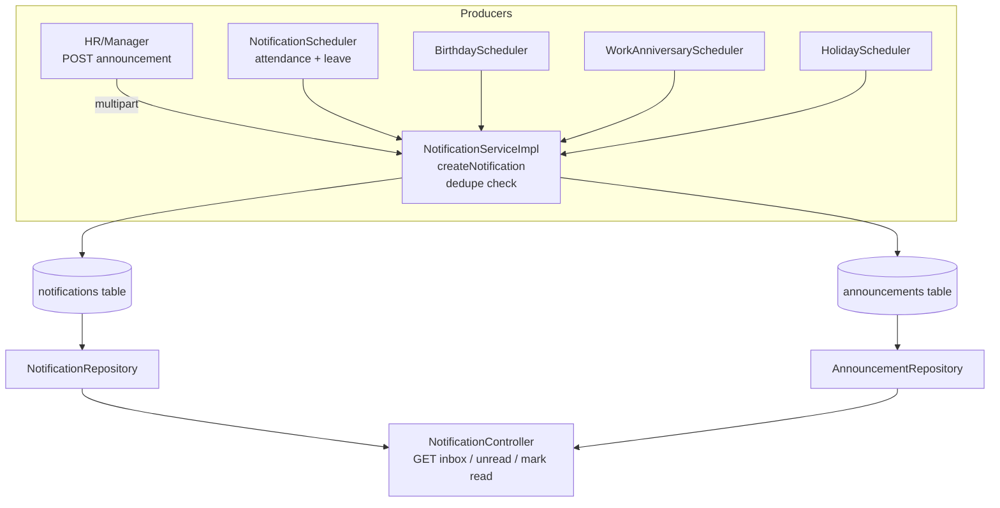

## Notification Module — Working Design

The module lives under [`notification/`](src/main/java/com/my_hourly/notification) and is a **two-part system**: (1) a per-employee **notification inbox** and (2) an **announcement broadcast** feature. It is *not* purely "current date" — it handles date-based events (birthdays, holidays, work anniversaries) **and** event-driven notifications (attendance, leave, announcements).

### 1. Core data model

**Two entities:**

- [`Notification`](src/main/java/com/my_hourly/notification/entity/Notification.java:18) — the per-user inbox row. Each row is tied to one `Employee` (many-to-one), with `title`, `message`, `notificationType`, `priority`, and a polymorphic `referenceType` + `referenceId` pair that links the notification back to the source record (a leave request, attendance row, holiday, employee, or announcement). It also carries an `isRead` flag.
- [`Announcement`](src/main/java/com/my_hourly/notification/entity/Announcement.java:17) — the broadcast content (title, message, and a collection of attachment URLs stored in a separate `announcement_attachment_urls` table).

**Enums** drive behavior:
- [`NotificationType`](src/main/java/com/my_hourly/notification/enums/NotificationType.java:3) — LEAVE_*, LATE_CHECK_IN, ABSENT, MISSED_CHECKOUT, HOLIDAY, BIRTHDAY, WORK_ANNIVERSARY, ANNOUNCEMENT, GENERAL.
- [`ReferenceType`](src/main/java/com/my_hourly/notification/enums/ReferenceType.java:3) — LEAVE, ATTENDANCE, HOLIDAY, EMPLOYEE, ANNOUNCEMENT, GENERAL.
- [`NotificationPriority`](src/main/java/com/my_hourly/notification/enums/NotificationPriority.java:3) — LOW / MEDIUM / HIGH.

### 2. How notifications get created (two paths)

**A. Manual / broadcast path — Announcements** ([`createAnnouncement()`](src/main/java/com/my_hourly/notification/service/impl/NotificationServiceImpl.java:190)):
1. Uploads any attachments to B2 object storage via `FileStorageServiceB2`.
2. Saves the `Announcement` row.
3. Iterates **all employees** and calls `createNotification(...)` for each, with `NotificationType.ANNOUNCEMENT`, `HIGH` priority, and `ReferenceType.ANNOUNCEMENT` pointing at the announcement id.

**B. Automated / scheduled path** — the schedulers call `createNotification(...)` for each affected employee.

The central guard is in [`createNotification()`](src/main/java/com/my_hourly/notification/service/impl/NotificationServiceImpl.java:149): it checks `existsByEmployeeIdAndReferenceTypeAndReferenceIdAndNotificationType` and **skips duplicates**. This is what makes the schedulers idempotent — a notification for a given (employee, reference, type) is only ever created once, even though the schedulers run frequently.

### 3. The schedulers (the "current date" part)

There are **four** scheduler components, all currently using `*/15 * * * * *` (every 15 seconds — likely a dev/testing value, not production):

| Scheduler | What it does | Date logic |
|---|---|---|
| [`NotificationScheduler`](src/main/java/com/my_hourly/notification/scheduler/NotificationScheduler.java:20) | Calls `processAttendanceNotifications()` + `processLeaveNotifications()` | Attendance: today's date; Leave: last 5 minutes of updates |
| [`BirthdayScheduler`](src/main/java/com/my_hourly/notification/scheduler/BirthdayScheduler.java:26) | Wishes the birthday employee + notifies everyone else | Matches `dateOfBirth` month/day to today |
| [`WorkAnniversaryScheduler`](src/main/java/com/my_hourly/notification/scheduler/WorkAnniversaryScheduler.java:26) | Same pattern for work anniversaries | Matches `dateOfJoining` month/day to today |
| [`HolidayScheduler`](src/main/java/com/my_hourly/notification/scheduler/HolidayScheduler.java:32) | "Holiday Today" + "Upcoming Holiday" reminders | Today and tomorrow's holiday dates |

**Attendance** ([`processAttendanceNotifications()`](src/main/java/com/my_hourly/notification/service/impl/NotificationServiceImpl.java:227)): pulls today's attendance rows and, based on status, creates LATE_CHECK_IN / ABSENT / MISSED_CHECKOUT notifications, **and also notifies the employee's reporting manager** via [`notifyReportingManager()`](src/main/java/com/my_hourly/notification/service/impl/NotificationServiceImpl.java:292).

**Leave** ([`processLeaveNotifications()`](src/main/java/com/my_hourly/notification/service/impl/NotificationServiceImpl.java:320)): scans leave requests updated in the last 5 minutes and creates APPROVED / REJECTED / CANCELLED notifications, again notifying the manager.

> Note: The `processBirthdayNotifications()`, `processWorkAnniversaryNotifications()`, and `processHolidayNotifications()` methods in the service are **commented out** — the logic was moved into the dedicated scheduler classes. The `processDailyNotifications()` method in `NotificationScheduler` is also commented out.

### 4. Read/query API (the inbox)

[`NotificationController`](src/main/java/com/my_hourly/notification/controller/NotificationController.java:25) exposes:
- `GET /api/v1/notifications` — paginated inbox for the logged-in employee, newest first. It also batch-loads announcement attachments and injects them into the response via the mapper.
- `GET /api/v1/notifications/unread-count` — unread badge count.
- `PATCH /api/v1/notifications/{id}/read` — mark one read (ownership-checked via `findByIdAndEmployee`).
- `PATCH /api/v1/notifications/read-all` — mark all read.
- `POST /api/v1/notifications/announcement` — multipart create (MANAGER/HR_ADMIN/SUPER_ADMIN only).

The [`NotificationMapper`](src/main/java/com/my_hourly/notification/mapper/NotificationMapper.java:16) converts entities to [`NotificationResponse`](src/main/java/com/my_hourly/notification/api/response/NotificationResponse.java), optionally attaching announcement URLs.

### 5. Architecture flow



### Direct answer to your question

**Is it "current date notification and announcement"?** Partially — it's broader than that:

- **Yes, it handles current-date events**: birthdays, work anniversaries, and today's/tomorrow's holidays are all matched against `LocalDate.now()`.
- **But it also handles non-date events**: attendance status (late/absent/missed checkout) and leave approvals/rejections are event-driven, triggered by recent data changes rather than the calendar.
- **And it handles announcements**: HR/manager broadcasts to all employees, with file attachments.

So the module is a **unified notification inbox** that aggregates three kinds of content: **date-based celebrations/reminders**, **event-driven attendance & leave alerts**, and **manual announcements** — all deduplicated and delivered per-employee.

One thing worth flagging: the `*/15 * * * * *` cron (every 15 seconds) on all four schedulers is almost certainly a development/testing value. In production this would hammer the DB and generate heavy load (e.g., iterating all employees on every run). The commented-out code suggests the intended production cadence was daily at 9:00 AM for the date-based events.


Here are recommended scheduler timings based on the nature of each event. The key principle: **date-based events run once per day at a fixed time; event-driven alerts run on a short poll interval (or better, are triggered at the moment of change); attendance finalization runs after the day's cutoff.**

## Recommended scheduler timing by event

| Scheduler / Event | Current cron | Recommended cron | Rationale |
|---|---|---|---|
| **Birthday** ([`BirthdayScheduler`](src/main/java/com/my_hourly/notification/scheduler/BirthdayScheduler.java:26)) | `*/15 * * * * *` (15s) | `0 0 8 * * *` (daily 08:00) | Date-based; once per day in the morning is enough. Dedupe guard prevents repeats. |
| **Work Anniversary** ([`WorkAnniversaryScheduler`](src/main/java/com/my_hourly/notification/scheduler/WorkAnniversaryScheduler.java:26)) | `*/15 * * * * *` (15s) | `0 0 8 * * *` (daily 08:00) | Same as birthday — daily morning. |
| **Holiday Today** ([`HolidayScheduler.sendTodayHolidayNotification`](src/main/java/com/my_hourly/notification/scheduler/HolidayScheduler.java:32)) | `*/15 * * * * *` (15s) | `0 0 8 * * *` (daily 08:00) | Date-based; morning before work starts. |
| **Holiday Tomorrow reminder** ([`HolidayScheduler.sendTomorrowHolidayReminder`](src/main/java/com/my_hourly/notification/scheduler/HolidayScheduler.java:69)) | `* */5 * * * *` (5 min) | `0 0 18 * * *` (daily 18:00) | Evening reminder the day before. |
| **Attendance** (late/absent/missed checkout) ([`processAttendanceNotifications()`](src/main/java/com/my_hourly/notification/service/impl/NotificationServiceImpl.java:227)) | `*/15 * * * * *` (15s) | `0 30 23 * * *` (daily 23:30) — *after attendance finalization* | Statuses are only meaningful once the day's attendance is finalized. Running every 15s is wasteful and can fire before the day ends. |
| **Leave** (approved/rejected/cancelled) ([`processLeaveNotifications()`](src/main/java/com/my_hourly/notification/service/impl/NotificationServiceImpl.java:320)) | `*/15 * * * * *` (15s) | `0 */5 * * * *` (every 5 min) — **or better, trigger inline** | Event-driven; a 5-min poll is acceptable, but the ideal is to call `createNotification` directly in the leave service at the moment of status change (no polling at all). |

## Key recommendations

1. **Date-based events (birthday, anniversary, holidays) → run once daily.** The `*/15 * * * * *` (every 15 seconds) is clearly a dev/testing value. Since [`createNotification()`](src/main/java/com/my_hourly/notification/service/impl/NotificationServiceImpl.java:149) dedupes on `(employee, referenceType, referenceId, notificationType)`, running daily is safe — no duplicate notifications.

2. **Attendance → run once after the day's cutoff, not continuously.** Late/absent/missed-checkout statuses are only final at end of day. Running every 15s both wastes resources and risks notifying "absent" before the employee checks in. Schedule it after your attendance finalization time (e.g., 23:30).

3. **Leave → prefer event-driven over polling.** The current design polls for leave requests updated in the last 5 minutes. A cleaner design is to invoke `createNotification(...)` directly inside the leave approval/rejection service method, so the notification is created the instant the status changes — no scheduler needed for this event.

4. **Consolidate the daily jobs.** Birthday, work anniversary, and holiday-today can share one daily cron (e.g., 08:00) rather than three separate schedulers, reducing overhead and making the cadence consistent.

## Suggested consolidated schedule

```text
# Daily morning (08:00) — date-based events
0 0 8 * * *   → Birthday + Work Anniversary + Holiday Today

# Daily evening (18:00) — tomorrow's holiday reminder
0 0 18 * * *  → Holiday Tomorrow

# Daily end-of-day (23:30) — attendance finalization
0 30 23 * * * → Late / Absent / Missed Checkout

# Leave — no scheduler; trigger inline on status change
(remove processLeaveNotifications polling)
```

This gives you: **once-daily date events, once-daily attendance finalization, and instant leave notifications** — eliminating the 15-second polling entirely.