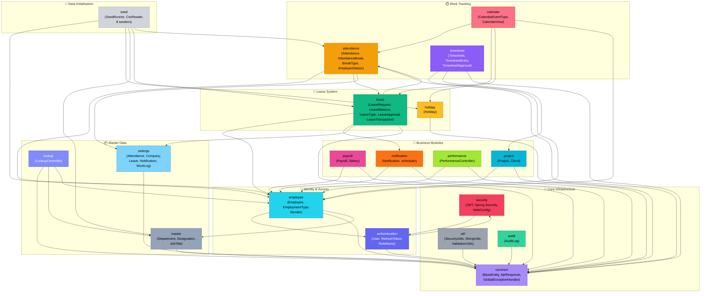

# MyHourly — Architecture Graph

> Spring Boot 4.0 · Java 21 · JPA · JWT · MySQL/PostgreSQL

**Open the interactive graph:** [myhourly_architecture.html](file:///C:/Users/User/.gemini/antigravity-ide/brain/7f6897ce-5411-4497-b906-17e6e56578ab/myhourly_architecture.html)

The graph is a fully interactive, force-directed canvas visualization with:
- 🖱️ **Drag nodes** to rearrange layout
- 🔍 **Click a node** to see the info panel (file counts, entities, endpoints, deps)
- 🎯 **Click a module in the sidebar** to highlight its connections
- 🖱️ **Scroll** to zoom, **drag background** to pan
- **Reset View** button to restore initial layout

---

## Module Dependency Graph

---

## Module Layer Breakdown

| Module | Controllers | Services | Repositories | Entities | Total Files |
|--------|:-----------:|:--------:|:------------:|:--------:|:-----------:|
| 🔐 Authentication | 2 | 2 | 3 | 5 | ~14 |
| 👤 Employee | 1 | 2 | 1 | 3 | ~10 |
| 🕐 Attendance | 1 | 2 | 2 | 5 | ~18 |
| 🌴 Leave | 5 | 5 | 4 | 5 | ~28 |
| 💰 Payroll | 3 | — | — | 2 | ~5 |
| 📋 Timesheet | 1 | — | — | 3 | ~4 |
| 🔔 Notification | 1 | 1 | 1 | 1 | ~7 |
| 🏗️ Project | 2 | — | — | — | ~2 |
| 📈 Performance | 1 | — | — | — | ~1 |
| 📅 Calendar | 1 | 2 | — | — | ~5 |
| 🎉 Holiday | 1 | 2 | 1 | 1 | ~6 |
| 📦 Master Data | 3 | 3 | 3 | 3 | ~12 |
| ⚙️ Settings | 1 | 4 | 4 | 4 | ~22 |
| 🛡️ Security | — | — | — | — | ~11 |
| 🔧 Common | — | — | — | 1 | ~16 |
| 📝 Audit | — | 1 | — | 1 | ~2 |
| 🔍 Lookup | 1 | — | — | — | ~1 |
| 🌱 Seed | — | — | — | — | ~11 |
| 🛠️ Util | — | — | — | — | ~3 |

---

## Key Architectural Observations

> [!NOTE]
> **Layered Architecture** — Every domain module follows a strict `Controller → Service → Repository → Entity` pattern. DTOs are cleanly separated into `api/request` and `api/response` packages.

> [!TIP]
> **Central Hub: `common` module** — `BaseEntity`, `ApiResponse<T>`, `PageResponse<T>`, `GlobalExceptionHandler`, and `ErrorCode` are shared by all 19 modules. This is the architectural foundation.

> [!IMPORTANT]
> **Most Complex Module: `leave`** — 5 controllers, 5 services, 4 repositories, scheduler, and cross-cutting integration with `attendance`, `notification`, `settings`, and `employee`. It is the primary business-critical domain.

> [!NOTE]
> **Security Model** — JWT-based stateless authentication with refresh tokens, revoked token tracking, and `CustomUserDetails`. Spring Security's `SecurityFilterChain` is configured in `security.config`.

> [!TIP]
> **Incomplete Modules** — `payroll`, `timesheet`, `project`, and `performance` currently only have controllers/entities scaffolded. Services and repositories are not yet implemented — good candidates for next development sprints.

> [!NOTE]
> **Settings Architecture** — The `settings` module uses a `BaseSettings` abstract class with 5 domain-specific sub-modules (attendance, company, leave, notification, workLogs), each with their own entity/repo/service/mapper/controller.
